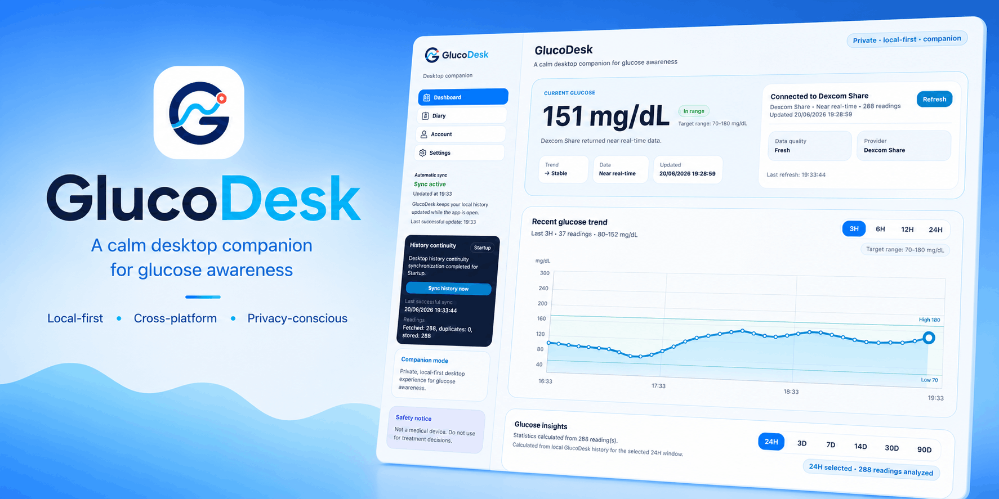
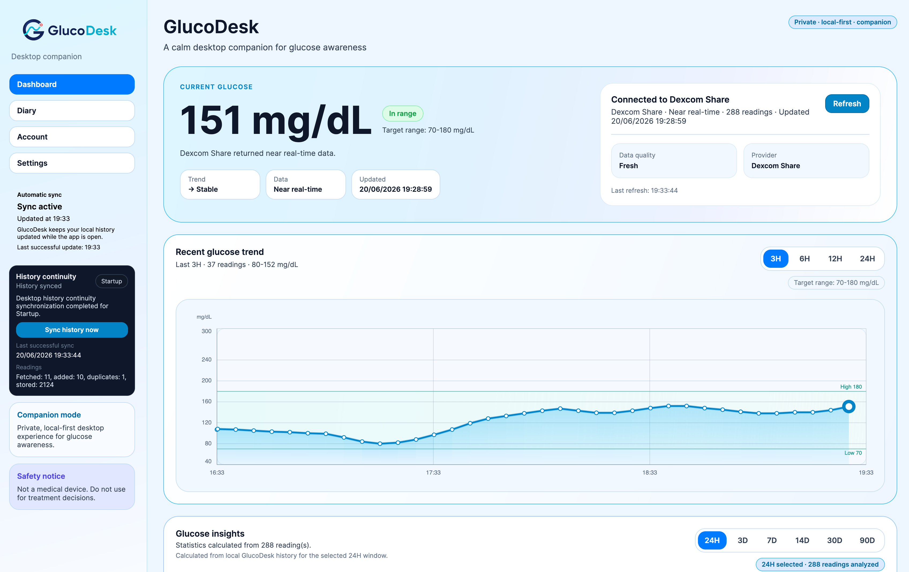
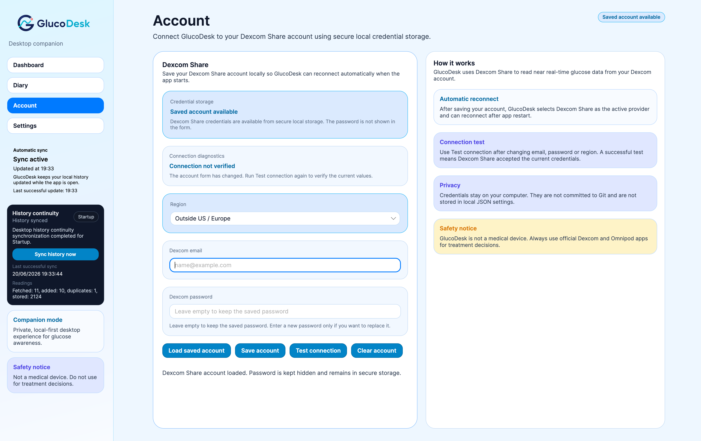
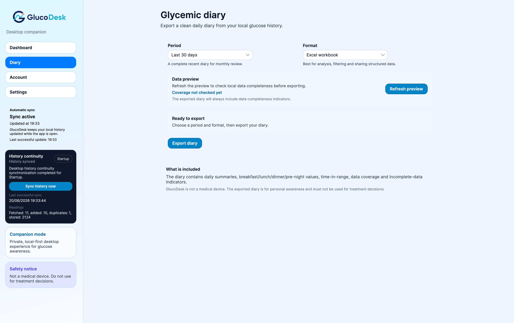
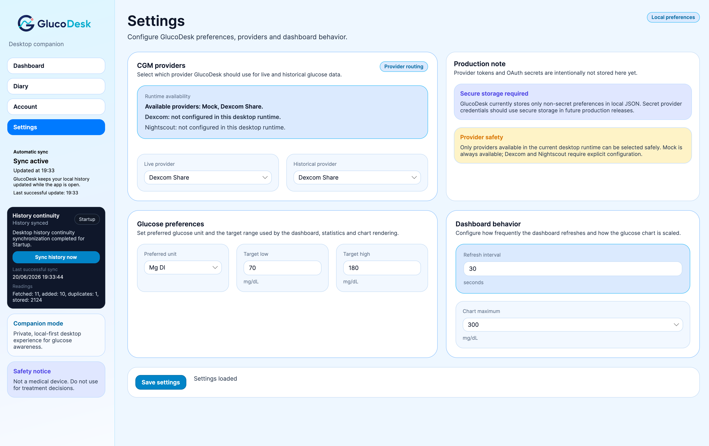

<p align="center">
  
  
  
  
  
  
  
</p>

<h1 align="center">GlucoDesk</h1>

<p align="center">
  <strong>A calm desktop companion for glucose awareness.</strong>
</p>

<p align="center">
  GlucoDesk is a local-first desktop app that helps people keep an eye on CGM glucose data while working on a computer.
</p>

<p align="center">
  It brings glucose trend, recent history, local background sync, data completeness awareness, settings, account configuration and glycemic diary export into a clean desktop experience.
</p>

---

<p align="center">
  
</p>

> [!IMPORTANT]
> **Safety notice**
>
> GlucoDesk is not a medical device and must not be used for treatment decisions, insulin dosing, emergency alerts, or as a replacement for approved diabetes applications.
>
> Always use approved medical devices and official medical apps for therapy decisions.

> [!WARNING]
> **Preview status**
>
> GlucoDesk is currently a preview project.
>
> The app is intended for awareness, personal review and desktop convenience only.
>
> The current preview supports macOS packages and introduces a Windows portable preview package. Windows support should still be considered early until validated on real Windows machines across the main runtime flows.

---

## Table of contents

* [What is GlucoDesk?](#what-is-glucodesk)
* [Preview](#preview)
* [Why GlucoDesk?](#why-glucodesk)
* [Current release status](#current-release-status)
* [Key features](#key-features)
* [Privacy model](#privacy-model)
* [Installation preview](#installation-preview)
* [Build from source](#build-from-source)
* [Create local preview packages](#create-local-preview-packages)
* [Architecture overview](#architecture-overview)
* [Quality and release engineering](#quality-and-release-engineering)
* [Known limitations](#known-limitations)
* [Roadmap](#roadmap)
* [Disclaimer](#disclaimer)
* [License](#license)

---

## What is GlucoDesk?

GlucoDesk is a desktop companion for glucose awareness.

It is designed for people who spend many hours at a computer and want a calmer way to keep glucose information close to their work without constantly reaching for their phone.

GlucoDesk focuses on:

* current glucose value and trend;
* recent glucose chart;
* data freshness and provider status;
* local glucose history;
* background synchronization;
* history continuity and gap reduction;
* glucose insights over selectable time windows;
* readable glycemic diary export;
* configurable display preferences;
* privacy-conscious local storage.

The goal is simple:

> Make glucose awareness more comfortable during desktop work, without replacing official medical apps or devices.

GlucoDesk uses a provider-based architecture so the project can evolve beyond a single data source over time.

---

## Preview

GlucoDesk is currently in **v0.2.0-preview**.

This preview focuses on turning the app into a more complete desktop product loop:

```text
Connect an optional CGM data source
→ show glucose awareness on desktop
→ keep local history updated
→ reduce local history gaps
→ analyze recent glucose windows
→ export a readable glycemic diary
→ keep preferences consistent across app and exports
```

### Dashboard



The dashboard shows the current glucose value, trend, data freshness, provider status, recent glucose chart and glucose insights in a desktop-friendly layout.

The current preview includes:

* a redesigned dashboard hierarchy;
* recent glucose trend visualization;
* target range indicators;
* selectable insight windows;
* time-in-range summary;
* average glucose;
* below-range and above-range exposure;
* local history status;
* clear safety messaging.

### Account



The Account page provides a cleaner place to configure provider-related account information and connection checks.

It is designed around a local-first workflow and keeps account configuration separate from the main dashboard experience.

> [!NOTE]
> Platform-specific secure credential handling is still evolving.
>
> macOS is the primary validated flow at this stage. Windows portable preview support has been introduced, but credential-store behavior should still be validated carefully on real Windows machines.

### Glycemic diary export



The diary export is designed to generate readable Excel and PDF summaries from local glucose history.

The export flow focuses on useful daily summaries instead of overwhelming the user with every single CGM data point.

The current preview supports:

* Excel diary export;
* PDF diary export;
* daily summaries;
* time-block summaries;
* data completeness reporting;
* clear incomplete-data awareness;
* selected display unit support.

### Settings



The Settings page controls provider routing, glucose preferences and dashboard behavior.

The current preview includes improved settings handling for:

* active live provider;
* historical provider;
* preferred glucose unit;
* target range;
* dashboard refresh interval;
* chart maximum;
* consistent unit conversion across the app and exported files.

---

## Why GlucoDesk?

Many people spend hours at their desk every day.

When glucose information is only available through a phone, checking it repeatedly can become distracting.

GlucoDesk was created to make that experience calmer:

* keep glucose awareness visible while working;
* avoid constantly switching context to the phone;
* understand whether data is fresh, stale or unavailable;
* keep a local glucose history;
* reduce missing local history where possible;
* export a readable diary for personal review;
* avoid unnecessary backend services;
* keep the app focused, quiet and desktop-friendly.

GlucoDesk is not intended to replace official apps.

It is a companion experience for awareness, personal review and desktop convenience.

---

## Current release status

Current version:

```text
0.2.0-preview
```

The preview focuses on:

* redesigned desktop glucose dashboard;
* optional CGM provider integration;
* local glucose history;
* background synchronization;
* startup and resume history continuity;
* local data completeness awareness;
* glucose insights;
* preferred glucose unit support;
* Excel diary export;
* PDF diary export;
* updated app branding and screenshots;
* macOS preview packaging;
* Windows portable preview packaging.

Current runtime support:

| Platform            | Status                     | Notes                                 |
| ------------------- | -------------------------- | ------------------------------------- |
| macOS Apple Silicon | Preview supported          | Distributed as `osx-arm64` package    |
| macOS Intel         | Preview supported          | Distributed as `osx-x64` package      |
| Windows x64         | Portable preview available | Distributed as `win-x64` portable zip |
| Linux               | Not supported yet          | Planned for a future step             |

Windows support currently means a portable preview package, not a full installer.

Linux remains part of the cross-platform roadmap but is not a supported runtime target in this preview.

---

## Key features

### Desktop glucose dashboard

GlucoDesk shows:

* current glucose value;
* trend direction;
* data freshness;
* provider status;
* recent glucose chart;
* target range indicators;
* glucose insights;
* safety notice.

The UI is designed to stay calm, readable and useful during desktop work.

### Glucose insights

The dashboard includes glucose insight windows based on local history.

Current insight areas include:

* time in range;
* average glucose;
* below-range exposure;
* above-range exposure;
* analyzed reading count;
* selected time window.

These insights are intended for awareness and personal review only.

### Preferred glucose unit

GlucoDesk supports display preferences for:

* `mg/dL`;
* `mmol/L`.

The selected unit is applied consistently across:

* dashboard value presentation;
* chart labels;
* target range display;
* settings fields;
* chart maximum selection;
* Excel diary export;
* PDF diary export.

Internally, glucose data remains normalized so the app can keep storage and calculations consistent while presenting values in the preferred unit.

### CGM provider routing

GlucoDesk follows a provider-based architecture.

The desktop app can route live and historical glucose data through configured CGM providers.

The current preview focuses on practical desktop usage while keeping the architecture open to future provider extensions.

### Account configuration and connection diagnostics

The Account page clearly separates provider account configuration from the dashboard.

The connection flow is designed to show whether the configured connection is:

* not tested;
* not verified;
* verified;
* failed;
* stale after configuration changes.

### Local history

GlucoDesk stores glucose history locally on the user’s computer.

Local history powers:

* recent glucose chart;
* dashboard insights;
* background sync status;
* diary export;
* data completeness reporting.

### Background sync status

The sidebar shows whether local history is up to date and when the last successful update happened.

This makes it easier to understand whether the local view is fresh or outdated.

### History continuity

GlucoDesk includes a history continuity workflow to reduce missing local glucose history where possible.

The app can run startup or resume synchronization and store fetched readings locally.

This is especially important for future diary export and completeness reporting.

### Glycemic diary export

GlucoDesk can export a glycemic diary in:

* Excel workbook format;
* PDF format.

The diary is designed to be readable and focused on useful summaries instead of overwhelming the user with every single CGM data point.

The current diary direction focuses on:

* daily summaries;
* key time blocks;
* time-in-range information;
* data coverage indicators;
* incomplete-data awareness;
* structured data suitable for personal review.

### Windows portable preview

GlucoDesk now includes a Windows x64 portable preview build path.

The Windows package is distributed as a zip archive.

The expected usage is:

```text
Extract the zip
→ open the extracted folder
→ run GlucoDesk.Desktop.exe
```

This is not a Windows installer yet.

---

## Privacy model

GlucoDesk is built with a local-first mindset.

By design:

* glucose history is stored locally on the user’s computer;
* app settings are stored locally;
* dashboard and widget-related state are stored locally;
* credentials should be handled through the configured secure credential store;
* credentials must not be committed to Git;
* GlucoDesk does not require a custom backend to handle user credentials or glucose history.

Local-first does not mean that no sensitive data exists.

Glucose readings are personal health-related data and are stored locally when history features are enabled.

The privacy goal is:

> Keep user data on the user’s machine and avoid unnecessary external services.

Users should still protect their computer account, disk, backups and operating-system credential store.

---

## Installation preview

Download the latest preview package from GitHub Releases.

Available package targets:

```text
GlucoDesk-0.2.0-preview-osx-arm64.zip
GlucoDesk-0.2.0-preview-osx-x64.zip
GlucoDesk-0.2.0-preview-win-x64-portable.zip
```

Use:

* `osx-arm64` for Apple Silicon Macs;
* `osx-x64` for Intel Macs;
* `win-x64-portable` for Windows 64-bit preview usage.

### macOS

Unzip the package and open:

```text
GlucoDesk.app
```

The preview app is not signed or notarized yet.

On macOS, the first launch may require:

```text
Right click → Open
```

This is expected for an unsigned preview build.

### Windows

Unzip the portable package and run:

```text
GlucoDesk.Desktop.exe
```

The Windows preview is currently portable.

It does not install the app into the Start Menu and does not create a system installer entry.

> [!NOTE]
> The Windows package is self-contained and is intended to include the required .NET runtime files.
>
> Windows support is still considered preview-level until the main runtime flows are validated on real Windows machines.

---

## Build from source

### Requirements

* .NET 10 SDK;
* macOS for macOS app bundle packaging;
* Windows for validating the Windows portable package on the target platform.

### Restore, build, test and run

From the repository root:

```bash
dotnet restore
dotnet build -c Release
dotnet test -c Release
dotnet run --project src/GlucoDesk.Desktop/GlucoDesk.Desktop.csproj
```

### Full local verification

```bash
dotnet clean
dotnet restore
dotnet build -c Release
dotnet test -c Release
```

or:

```bash
./scripts/verify.sh
```

---

## Create local preview packages

### macOS Apple Silicon

```bash
./scripts/package-preview.sh osx-arm64
```

### macOS Intel

```bash
./scripts/package-preview.sh osx-x64
```

Generated macOS packages are written to:

```text
artifacts/releases/
```

### Windows x64 portable

From macOS, Linux or Windows, the Windows publish output can be produced with:

```bash
dotnet publish src/GlucoDesk.Desktop/GlucoDesk.Desktop.csproj \
  -c Release \
  -r win-x64 \
  --self-contained true \
  -p:PublishSingleFile=false \
  -o artifacts/publish/GlucoDesk-win-x64
```

On Windows, the portable zip can be generated with:

```powershell
.\scripts\publish-windows.ps1
```

Generated artifacts are written under:

```text
artifacts/
```

The `artifacts/` directory is ignored by Git.

---

## Architecture overview

GlucoDesk follows a layered .NET architecture.

```text
GlucoDesk.slnx
├── src
│   ├── GlucoDesk.Core
│   ├── GlucoDesk.Application
│   ├── GlucoDesk.Infrastructure
│   └── GlucoDesk.Desktop
├── tests
│   ├── GlucoDesk.Core.Tests
│   ├── GlucoDesk.Application.Tests
│   ├── GlucoDesk.Infrastructure.Tests
│   └── GlucoDesk.Desktop.Tests
├── docs
├── scripts
└── Directory.Build.props
```

### GlucoDesk.Core

Contains core domain concepts and shared glucose models.

This layer is independent from infrastructure, UI, file system and provider implementation details.

### GlucoDesk.Application

Contains application behavior, orchestration and abstractions.

This layer coordinates use cases such as:

* reading current glucose data;
* handling provider metadata;
* managing local history workflows;
* coordinating history continuity;
* preparing diary export data;
* exposing application-level results to the desktop UI.

### GlucoDesk.Infrastructure

Contains technical implementations.

This layer handles:

* CGM provider integrations;
* local storage;
* platform-aware local data paths;
* secure credential storage integration points;
* background sync infrastructure;
* history persistence;
* diary export generation;
* platform-specific integrations.

### GlucoDesk.Desktop

Contains the Avalonia desktop application.

This layer handles:

* desktop UI;
* view models;
* dependency injection composition;
* dashboard rendering;
* account configuration;
* settings screens;
* diary export user flow;
* desktop file save dialogs.

The desktop layer should remain focused on presentation and composition, while application and infrastructure behavior stay in dedicated layers.

---

## Quality and release engineering

GlucoDesk is developed as a production-oriented portfolio project.

Current quality practices include:

* layered architecture;
* provider-based design;
* local-first data model;
* platform-aware local storage paths;
* automated tests across core, application, infrastructure and desktop layers;
* shared build configuration through `Directory.Build.props`;
* nullable reference types enabled;
* warnings treated as errors;
* repository-level `.editorconfig`;
* GitHub Actions continuous integration;
* CI build and test on Ubuntu, macOS and Windows;
* Windows portable publish workflow;
* macOS preview packaging script;
* release-readiness documentation.

Run the full local validation with:

```bash
dotnet clean
dotnet restore
dotnet build -c Release
dotnet test -c Release
```

The current test suite covers core, application, infrastructure and desktop behavior.

---

## Known limitations

GlucoDesk is still a preview.

Current limitations:

* the app is not a medical device;
* the app must not be used for treatment decisions;
* macOS packages are not signed or notarized yet;
* Windows support is currently distributed as a portable preview package, not a full installer;
* Windows runtime behavior still needs broader real-machine validation;
* Linux runtime support is not available yet;
* platform-specific secure credential storage hardening is still evolving;
* provider runtime behavior may depend on platform, region and account configuration;
* local history completeness depends on sync availability and app runtime;
* data completeness reporting can only describe the available local history;
* app icon and brand assets may still evolve.

---

## Roadmap

Planned improvements include:

* polished public release packaging;
* stronger release automation;
* Windows installer support;
* Windows runtime validation and hardening;
* Linux packaging and runtime support;
* platform-specific secure credential storage hardening;
* improved first-run onboarding;
* improved dashboard empty states;
* improved dashboard error states;
* richer diary and data-completeness reporting;
* additional statistics views;
* macOS widget exploration;
* additional provider abstraction hardening;
* improved local history continuity and backfill behavior;
* README and release asset polish.

---

## Disclaimer

GlucoDesk is an independent software project.

It is not affiliated with, endorsed by, approved by, or sponsored by Dexcom, Insulet, Omnipod, or any other medical device manufacturer.

GlucoDesk is not a medical device.

Do not use GlucoDesk for treatment decisions, insulin dosing, emergency alerts, or as a replacement for approved diabetes applications.

For therapy decisions, always use approved medical devices and official medical apps.

---

## License

This project is licensed under the MIT License.

See [LICENSE](LICENSE) for details.
