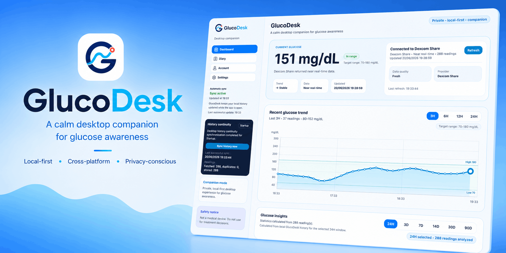
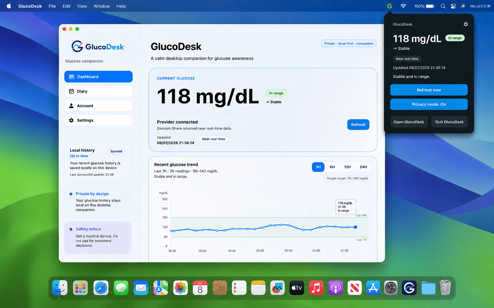
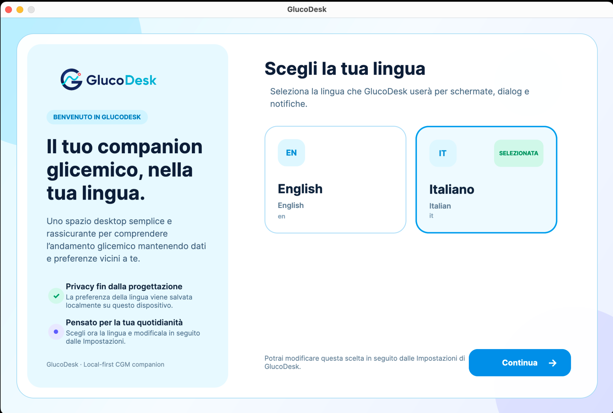

<p align="center">
  
  
  
  
  
  
  
  
</p>

<h1 align="center">GlucoDesk</h1>

<p align="center">
  <strong>A calm desktop companion for glucose awareness.</strong>
</p>

<p align="center">
  GlucoDesk is a local-first desktop app that helps people keep an eye on CGM glucose data while working on a computer.
</p>

<p align="center">
  It brings current glucose awareness, recent trends, local history, data completeness, privacy mode, glucose awareness notifications, glycemic diary export and a complete English and Italian experience into a clean desktop app.
</p>

---

<p align="center">
  
</p>

<p align="center">
  <a href="#installation-preview"><strong>Install preview</strong></a>
  ·
  <a href="#glucodesk-in-action"><strong>See it in action</strong></a>
  ·
  <a href="#multilingual-experience"><strong>Multilingual experience</strong></a>
  ·
  <a href="#guided-onboarding-and-feature-tour"><strong>Onboarding & feature tour</strong></a>
  ·
  <a href="#architecture-overview"><strong>Architecture</strong></a>
  ·
  <a href="#safety-disclaimer"><strong>Safety disclaimer</strong></a>
</p>

> [!IMPORTANT]
> **Safety notice**
>
> GlucoDesk is an awareness companion. It is not a medical device and must not be used for treatment decisions, insulin dosing, emergency alerts, diagnosis, or as a replacement for approved diabetes applications, medical devices or clinical guidance.
>
> Always use approved CGM apps, insulin pump systems, glucose meters, medical devices and healthcare professionals for therapy decisions.

> [!WARNING]
> **Preview status**
>
> GlucoDesk is currently a preview project.
>
> The current preview supports macOS Apple Silicon, macOS Intel and Windows x64 packages. macOS builds are not notarized yet and Windows builds are not code-signed yet, so first-launch approval may be required on both platforms.
>
> Linux is not supported in the current preview.

---

## Table of contents

* [What is GlucoDesk?](#what-is-glucodesk)
* [GlucoDesk in action](#glucodesk-in-action)
* [Multilingual experience](#multilingual-experience)
* [Guided onboarding and feature tour](#guided-onboarding-and-feature-tour)
* [Preview release status](#preview-release-status)
* [Installation preview](#installation-preview)
* [Key features](#key-features)
* [Privacy model](#privacy-model)
* [Build from source](#build-from-source)
* [Create local preview packages](#create-local-preview-packages)
* [Architecture overview](#architecture-overview)
* [Quality and release engineering](#quality-and-release-engineering)
* [Known limitations](#known-limitations)
* [Roadmap](#roadmap)
* [Safety disclaimer](#safety-disclaimer)
* [License](#license)
* [Additional documentation](#additional-documentation)

---

## What is GlucoDesk?

GlucoDesk is a desktop companion for glucose awareness.

It is designed for people who spend many hours at a computer and want a calmer way to keep glucose information close to their work without constantly reaching for their phone.

GlucoDesk focuses on:

* current glucose value and trend;
* recent glucose chart;
* data freshness and provider status;
* local glucose history;
* background synchronization;
* history continuity and gap reduction;
* glucose insights over selectable time windows;
* readable glycemic diary export;
* configurable display preferences;
* complete English and Italian localization;
* a guided first-run stepper and a reusable feature tour;
* persistent first-launch language and onboarding state;
* in-app and native glucose awareness notifications;
* configurable notification intervals, cooldown, consecutive-reading rules, snooze and anti-spam behavior;
* secure local credential storage where supported by the operating system;
* privacy-conscious local storage;
* local backup and restore with versioned ZIP manifests and reading deduplication;
* a quiet desktop presence through macOS menu bar and Windows tray companion flows;
* a responsive desktop layout with animated navigation icons;
* an About and Support area with project, version, website and feedback links.

The goal is simple:

> Make glucose awareness more comfortable during desktop work, without replacing official medical apps or devices.

GlucoDesk uses a provider-based architecture so the project can evolve beyond a single data source over time.

---

## GlucoDesk in action

<p align="center">
  
</p>

<p align="center">
  <em>Mock glucose data showing the macOS menu bar companion across in-range, high, low and privacy mode states.</em>
</p>

GlucoDesk is designed to stay useful while you work.

The macOS menu bar companion gives a quick glucose-awareness view without keeping the full dashboard in focus. The colored `G` icon reflects the current state at a glance:

* green `G` for in-range glucose;
* orange `G` for above-target glucose;
* red `G` for below-target glucose;
* blue `G` for privacy mode.

When privacy mode is enabled, the glucose value is hidden from the desktop popup while the app still keeps a calm presence in the menu bar.

The demo above uses mock data and is for product preview purposes only.

---

## Multilingual experience

<p align="center">
  
</p>

<p align="center">
  <em>A polished first-launch experience lets users choose their preferred language before entering GlucoDesk.</em>
</p>

GlucoDesk currently provides a complete desktop experience in:

* English;
* Italian.

On first launch, GlucoDesk shows a dedicated language-selection window before opening the main dashboard.

The onboarding flow:

* detects a suitable initial language from the operating-system culture when possible;
* presents every supported language as a clear, keyboard-accessible selection card;
* previews the interface language immediately when the selection changes;
* stores the confirmed preference locally on the user’s device;
* opens the main application only after the language has been confirmed;
* is skipped automatically on later launches;
* remains compatible with language changes from **Settings**.

The selected language is applied across:

* dashboard and navigation;
* account and connection diagnostics;
* settings and validation messages;
* glycemic diary and export dialogs;
* background synchronization status;
* in-app awareness messages;
* supported native notification text;
* dynamic runtime status messages.

The localization system uses a shared translation catalog with automated key-parity tests between supported languages. The onboarding UI is populated from the supported-language collection rather than being hard-coded for exactly two cards, making future language additions straightforward.

Language preferences remain local to the device and can be changed at any time from **Settings**.

---

## Guided onboarding and feature tour

GlucoDesk includes a first-run experience that introduces the product before the user reaches the main workspace.

The onboarding flow is implemented as a guided stepper rather than a single static page. It covers:

* language selection;
* the local-first privacy model;
* provider and account setup expectations;
* the live Dashboard;
* desktop presence through the macOS menu bar or Windows system tray;
* privacy mode;
* glucose awareness notifications;
* local history and continuity;
* glycemic diary export;
* the safety boundary between awareness software and approved medical devices.

The onboarding state is stored locally and is skipped automatically after completion.

The application also includes a reusable feature tour that can be opened again after first launch. The tour:

* uses localized English and Italian content;
* presents the main product areas with dedicated illustrations;
* does not reset provider, history or account state;
* remains separate from the persisted first-run completion flag;
* helps existing users review newly introduced capabilities after an update.

Both flows are designed to remain extensible as new product areas are added.


---

## Preview release status

GlucoDesk is currently distributed as **v0.3.0-preview**.

This preview focuses on turning GlucoDesk into a complete desktop product loop:

```text
Choose a preferred language
→ complete the guided onboarding stepper
→ connect an optional CGM data source
→ show glucose awareness on the desktop
→ keep local history updated
→ detect continuity gaps and backfill where the provider allows it
→ notify calmly when glucose is outside the configured range
→ review recent windows, completeness and recurring patterns
→ export a readable PDF or Excel glycemic diary
→ back up and restore portable local data safely
→ keep language, provider and display preferences consistent
→ access support and project information from inside the app
→ package and validate the app for macOS and Windows
```

### Supported preview platforms

| Platform            | Status            | Package type                                       | Notes                                           |
| ------------------- | ----------------- | -------------------------------------------------- | ----------------------------------------------- |
| macOS Apple Silicon | Preview supported | `macos-arm64-installable.zip` containing DMG       | Primary tested macOS target                     |
| macOS Intel         | Preview supported | `macos-x64-installable.zip` containing DMG         | Built by CI; physical Intel validation may vary |
| Windows x64         | Preview supported | `windows-x64-installable.zip` with setup installer | Available for preview testing                   |
| Linux               | Not supported yet | Not available                                      | Planned for a future step                       |

### Installation

Download the ready-to-run package from the GitHub Release assets.

Do not use the green GitHub **Code → Download ZIP** button to install GlucoDesk. That downloads the source code, not the app package.

The recommended installation flow is:

```text
GitHub Releases → Assets → download package → extract ZIP → install app
```

Detailed platform-specific steps are available in [Installation preview](#installation-preview).

### Privacy mode

GlucoDesk includes a desktop privacy mode for screen sharing and public environments.

When privacy mode is enabled:

* the glucose value is hidden from the menu bar presence panel;
* the menu bar icon uses the blue privacy state;
* the privacy mode state persists after restart.

### Safety disclaimer

GlucoDesk is an awareness companion.

It is not a medical device. It must not be used for diagnosis, treatment, insulin dosing, emergency decisions, or replacing official CGM apps, medical devices, or clinician guidance.

---

## Installation preview

Download the latest ready-to-run preview package from the [GitHub Releases page](https://github.com/FilippoGaravaglia/GlucoDesk/releases).

> [!IMPORTANT]
> The green **Code → Download ZIP** button downloads the source code, not the ready-to-run app.
>
> To install or try GlucoDesk, download one of the packages attached to the latest GitHub Release under **Assets**.

Latest recommended preview:

```text
v0.3.0-preview
```

Release page:

```text
https://github.com/FilippoGaravaglia/GlucoDesk/releases/tag/v0.3.0-preview
```

Available package targets for this preview:

```text
GlucoDesk-0.3.0-preview-macos-arm64-installable.zip
GlucoDesk-0.3.0-preview-macos-x64-installable.zip
GlucoDesk-0.3.0-preview-windows-x64-installable.zip
```

Choose the package for your operating system:

| System              | Download                                              |
| ------------------- | ----------------------------------------------------- |
| macOS Apple Silicon | `GlucoDesk-0.3.0-preview-macos-arm64-installable.zip` |
| macOS Intel         | `GlucoDesk-0.3.0-preview-macos-x64-installable.zip`   |
| Windows 64-bit      | `GlucoDesk-0.3.0-preview-windows-x64-installable.zip` |

Not sure which macOS package to use?

* Choose `macos-arm64` for Apple Silicon Macs with M1, M2, M3, M4 or newer chips.
* Choose `macos-x64` for Intel Macs.

### Package contents

The macOS installable ZIP packages contain:

* a platform-specific DMG;
* SHA256 checksum file;
* installation instructions.

The Windows installable ZIP package contains:

* Windows setup installer;
* SHA256 checksum file;
* installation instructions.

### First launch and language selection

On the first launch, GlucoDesk asks the user to choose a preferred language before opening the dashboard.

The current preview supports:

```text
English
Italiano
```

After the user confirms the selection:

1. the preference is stored locally;
2. the application opens in the selected language;
3. later launches go directly to the main window;
4. the language remains editable from **Settings**.

Existing users who already have a valid language preference are not shown the onboarding again.

### Updating an existing installation

Replacing the application bundle or installer version does not normally delete local data.

GlucoDesk stores app data and credentials outside the application files:

* macOS credentials are stored in macOS Keychain;
* Windows credentials are stored in Windows Credential Manager;
* local app data is stored in the operating-system application data location.

To update:

1. close GlucoDesk;
2. download the new package from the latest GitHub Release;
3. replace the old macOS app bundle or reinstall with the new Windows setup;
4. open GlucoDesk again.

### macOS Apple Silicon and Intel

Download the correct macOS package from the release assets.

For Apple Silicon Macs such as M1, M2, M3, M4 or newer, use:

```text
GlucoDesk-0.3.0-preview-macos-arm64-installable.zip
```

For Intel Macs, use:

```text
GlucoDesk-0.3.0-preview-macos-x64-installable.zip
```

After downloading:

1. extract the installable ZIP;
2. open the included `.dmg` file;
3. drag `GlucoDesk.app` to the `Applications` folder;
4. if macOS asks whether to replace an existing copy, choose **Replace**;
5. open GlucoDesk from `Applications`.

The preview app is currently not signed with Apple Developer ID and is not notarized.

Because of this, macOS Gatekeeper may block the first launch with a message saying that Apple cannot verify whether GlucoDesk contains malware.

If that happens:

1. click **Done** or close the warning dialog;
2. open **System Settings**;
3. go to **Privacy & Security**;
4. scroll to the **Security** section;
5. find the GlucoDesk warning;
6. click **Open Anyway**;
7. confirm with password or Touch ID;
8. launch GlucoDesk again from `Applications`.

This approval is normally required only once.

On first use of native notifications, macOS may ask permission for:

```text
GlucoDesk Notifications
```

Allow notifications if you want desktop glucose awareness prompts.

> [!NOTE]
> The recommended preview flow is:
>
> ```text
> Download ZIP → extract → open DMG → drag to Applications → approve from Privacy & Security if required
> ```
>
> Terminal commands such as `xattr` should not be needed as the primary user-facing installation path. A future release goal is to provide signed and notarized macOS packages.

### Windows x64

Download the Windows package from the release assets:

```text
GlucoDesk-0.3.0-preview-windows-x64-installable.zip
```

After downloading:

1. extract the installable ZIP;
2. run `GlucoDesk-0.3.0-preview-win-x64-setup.exe`;
3. follow the setup wizard;
4. read the safety notice page;
5. optionally create a desktop shortcut;
6. launch GlucoDesk from the Start Menu.

The Windows installer:

* installs GlucoDesk for the current Windows user;
* does not require administrator privileges;
* adds Start Menu shortcuts;
* can optionally create a desktop shortcut;
* includes the Mozilla Public License 2.0 page;
* includes a safety notice page before installation;
* supports standard Windows uninstall.

The Windows preview build is currently not code-signed.

Because of this, Microsoft Defender SmartScreen may show a warning such as:

```text
Windows protected your PC
```

If this happens:

1. click **More info**;
2. verify that the app name is the GlucoDesk installer downloaded from the official GitHub Release;
3. click **Run anyway**.

On Italian Windows, the buttons may appear as:

```text
Ulteriori informazioni
Esegui comunque
```

Only continue if you downloaded GlucoDesk from the official GitHub Releases page.

### Windows notification settings

If you do not see desktop notifications on Windows, check that notifications are allowed for GlucoDesk.

On Windows 11:

1. open **Settings**;
2. go to **System**;
3. open **Notifications**;
4. make sure notifications are enabled globally;
5. find GlucoDesk in the app list, if available;
6. enable notifications for GlucoDesk.

Windows notifications can also be hidden or delayed by Focus Assist, Do Not Disturb, notification rules, or system-level privacy settings.

GlucoDesk notifications are intended for calm glucose awareness only. They are not medical alarms and must not be used for emergency or treatment decisions.

> [!NOTE]
> The Windows package is self-contained and is intended to include the required .NET runtime files.

### Linux

Linux is not supported in the current preview.

The project is built with cross-platform technologies, but Linux runtime packaging and validation have not been completed yet.

### Verify release checksums

Each preview release includes SHA256 checksum files.

The current installable release bundle checksum file is:

```text
SHA256SUMS-installable.txt
```

To verify the top-level installable bundles on macOS or Linux:

```bash
shasum -a 256 -c SHA256SUMS-installable.txt
```

On Windows PowerShell, you can calculate hashes manually:

```powershell
Get-FileHash .\GlucoDesk-0.3.0-preview-windows-x64-installable.zip -Algorithm SHA256
```

Then compare the value with the checksum file.

---

## Key features

### Desktop glucose dashboard

The dashboard shows:

* current glucose value and trend direction;
* data freshness and provider status;
* recent glucose chart;
* target range indicators;
* selectable insight windows;
* local history status;
* safety notice.

The UI is designed to stay calm, readable and useful during desktop work.

### English and Italian localization

GlucoDesk provides a fully localized desktop experience in English and Italian.

The current localization covers:

* application navigation;
* dashboard content and dynamic glucose status;
* account configuration and connection diagnostics;
* settings, validation and save states;
* glycemic diary and export dialogs;
* background synchronization messages;
* glucose-awareness text;
* first-launch language onboarding.

The language is selected during the first-launch experience, stored locally and restored on later launches.

Users can change the language at any time from **Settings** without reinstalling or resetting the application.

The supported-language model and translation catalog are designed so additional languages can be introduced without redesigning the onboarding screen.

### macOS menu bar and Windows tray companion

GlucoDesk includes a small desktop presence outside the main window:

* on macOS, GlucoDesk appears in the menu bar;
* on Windows, GlucoDesk appears in the system tray / hidden icons area.

The companion icon provides quick access to the desktop popup and keeps the app close without requiring the main window to stay in focus.

On macOS, the menu bar `G` can reflect the current glucose-awareness state:

* green for in-range glucose;
* orange for above-target glucose;
* red for below-target glucose;
* blue for privacy mode.

This makes GlucoDesk glanceable during desktop work while still keeping the full dashboard available when more context is needed.

This feature is intended for desktop convenience only.

It is not an alarm system and must not be used for emergency or safety-critical notifications.

### Glucose awareness notifications

GlucoDesk includes calm, non-medical glucose awareness notifications.

The current preview includes:

* in-app glucose awareness banner;
* automatic above-target and below-target awareness states;
* optional native macOS notifications;
* notification cooldown;
* anti-spam behavior;
* configurable required consecutive out-of-range readings;
* privacy-conscious notification wording;
* snooze and dismiss behavior;
* manual native notification test flow from Settings;
* notification request result model;
* event logging for native notification request outcomes.

On macOS, native notifications are delivered through a bundled helper app inside the main app package:

```text
GlucoDesk.app/Contents/Helpers/GlucoDeskNotificationHelper.app
```

On first use, macOS may ask permission for **GlucoDesk Notifications**.

Native notifications can be delayed, blocked, or hidden by operating-system notification permissions, Focus / Do Not Disturb modes, or other platform settings.

This feature is intended for desktop awareness only.

It is not an alarm system and must not be used for emergency or safety-critical notifications.

### Glucose insights

The dashboard includes glucose insight windows based on local history.

Current insight areas include:

* time in range;
* average glucose;
* below-range exposure;
* above-range exposure;
* analyzed reading count;
* selected time window.

These insights are intended for awareness and personal review only.

### Preferred glucose unit

GlucoDesk supports display preferences for:

* `mg/dL`;
* `mmol/L`.

The selected unit is applied consistently across:

* dashboard value presentation;
* chart labels;
* target range display;
* settings fields;
* chart maximum selection;
* Excel diary export;
* PDF diary export.

Internally, glucose data remains normalized so the app can keep storage and calculations consistent while presenting values in the preferred unit.

### CGM provider routing

GlucoDesk follows a provider-based architecture.

The desktop app can route live and historical glucose data through configured CGM providers.

The current preview focuses on practical desktop usage while keeping the architecture open to future provider extensions.

### Account configuration and connection diagnostics

The Account page clearly separates provider account configuration from the dashboard.

The connection flow is designed to show whether the configured connection is:

* not tested;
* not verified;
* verified;
* failed;
* stale after configuration changes.

Credential persistence is platform-aware:

* on macOS, credentials are stored through macOS Keychain;
* on Windows, credentials are stored through Windows Credential Manager.

Credentials are used locally by the desktop app to connect to the configured provider.

GlucoDesk does not provide a custom backend for handling user credentials.

### Local history and background sync

GlucoDesk stores glucose history locally on the user’s computer.

Local history powers:

* recent glucose chart;
* dashboard insights;
* background sync status;
* diary export;
* data completeness reporting.

The sidebar shows whether local history is up to date and when the last successful update happened.

### History continuity

GlucoDesk includes a history continuity workflow to reduce missing local glucose history where possible.

The app can run startup or resume synchronization and store fetched readings locally.

This is especially important for diary export and completeness reporting.

### Glycemic diary export

GlucoDesk can export a glycemic diary in:

* Excel workbook format;
* PDF format.

The diary is designed to be readable and focused on useful summaries instead of overwhelming the user with every single CGM data point.

The current diary direction focuses on:

* daily summaries;
* key time blocks;
* time-in-range information;
* data coverage indicators;
* incomplete-data awareness;
* structured data suitable for personal review.

### Settings

The Settings page controls language, provider routing, glucose preferences, dashboard behavior and glucose awareness notifications.

The current preview includes improved settings handling for:

* application language;
* persistent language preference;
* active live provider;
* historical provider;
* preferred glucose unit;
* target range;
* dashboard refresh interval;
* chart maximum;
* in-app glucose awareness alerts;
* native notification opt-in;
* notification cooldown;
* required consecutive out-of-range readings;
* privacy-conscious notification wording;
* consistent unit conversion across the app and exported files.


### Guided first-run experience

The first launch is intentionally structured and does not drop the user directly into an unconfigured dashboard.

The onboarding stepper:

* starts with language selection;
* explains the local-first model;
* introduces providers, history, notifications and privacy mode;
* presents the diary and export workflow;
* records completion locally;
* is fully localized in English and Italian;
* is covered by persistence and localization tests.

A separate feature tour can be reopened later without resetting application state.

### Local backup and restore

GlucoDesk can export portable local data to a versioned ZIP archive and safely import it again.

The backup workflow includes:

* a versioned manifest;
* application preferences that are safe to move between installations;
* local glucose history;
* validation of archive structure and supported versions;
* merge and deduplication of imported glucose readings;
* protection against malformed or unsupported archives;
* clear success and error feedback;
* preservation of the currently active language;
* preservation of secure credentials and machine-specific local state;
* provider-selection refresh after restore.

Credentials are intentionally excluded from portable backup archives.

This design allows history and selected preferences to be moved without turning the backup into a credential export.

### History continuity and completeness

Local history is not treated as complete merely because readings exist.

GlucoDesk models and reports continuity explicitly through:

* startup and resume synchronization;
* provider backfill capability detection;
* gap detection;
* backfill where supported;
* reading deduplication;
* complete, partial, in-progress and empty-period states;
* daily and reporting-window data completeness;
* export warnings when local history is incomplete.

This prevents charts, statistics and diary reports from silently presenting incomplete local data as authoritative.

### Daily and weekly review

The diary and insight pipeline includes more than a raw list of CGM readings.

It can produce:

* daily summaries;
* key time-block summaries;
* 14-day and 30-day rolling windows;
* previous-period comparisons;
* weekly “what changed?” style review;
* recurring pattern summaries;
* reliability thresholds before reporting patterns;
* transparent completeness information.

The goal is to surface useful context without overwhelming users with every individual CGM sample.

### About and support

GlucoDesk includes an in-app About and Support area with:

* current application version;
* product and preview status;
* official website;
* GitHub repository;
* support and feedback links;
* open-source and license information;
* safety disclaimer.

### Desktop interaction and visual polish

The desktop shell includes production-oriented interaction details such as:

* animated vector sidebar icons;
* clear selected, hover and focus states;
* responsive layouts for smaller windows;
* stable runtime language switching;
* consistent status and validation feedback;
* single-instance behavior;
* macOS application menu naming;
* system tray and menu bar actions for opening, privacy mode and quitting;
* privacy-safe presence-panel rendering.


---

## Privacy model

GlucoDesk is built with a local-first mindset.

By design:

* glucose history is stored locally on the user’s computer;
* app settings are stored locally;
* the selected interface language is stored locally;
* dashboard and tray/menu-bar state are stored locally;
* credentials are handled through the configured operating-system credential store where supported;
* credentials must not be committed to Git;
* GlucoDesk does not require a custom backend to handle user credentials or glucose history.

Local-first does not mean that no sensitive data exists.

Glucose readings are personal health-related data and are stored locally when history features are enabled.

The privacy goal is:

> Keep user data on the user’s machine and avoid unnecessary external services.

Users should still protect their computer account, disk, backups and operating-system credential store.

---

## Build from source

This section is intended for developers who want to inspect, modify or build the project locally.

If you only want to try the app, use the packages attached to the latest GitHub Release instead of cloning or downloading the source code.

### Requirements

* .NET 10 SDK;
* macOS for macOS app bundle and DMG packaging;
* Windows for validating the Windows installer and tray behavior on the target platform.

### Restore, build, test and run

From the repository root:

```bash
dotnet restore
dotnet build -c Release
dotnet test -c Release
dotnet run --project src/GlucoDesk.Desktop/GlucoDesk.Desktop.csproj
```

### Full local verification

```bash
dotnet clean
dotnet restore
dotnet build -c Release
dotnet test -c Release
```

or:

```bash
./scripts/verify.sh
```

---

## Create local preview packages

This section is intended for developers and maintainers who want to generate release packages locally.

Regular users should download ready-to-run packages from the GitHub Releases page.

### macOS release assets

On macOS:

```bash
./scripts/create-macos-preview-release-assets.sh 0.3.0-preview all
```

This generates macOS preview assets for:

* `osx-arm64`;
* `osx-x64`.

Generated artifacts are written under:

```text
artifacts/macos/
```

### Windows release assets

On Windows PowerShell:

```powershell
.\scripts\create-windows-preview-release-assets.ps1 -Version "0.3.0-preview"
```

This generates:

* Windows setup installer;
* Windows checksum file;
* Windows release manifest.

Generated artifacts are written under:

```text
artifacts/windows/
```

### GitHub Actions release artifacts

Maintainers can generate release artifacts through the manual GitHub Actions workflow:

```text
Preview release artifacts
```

The workflow builds, tests, packages and uploads macOS and Windows preview artifacts.

After downloading workflow artifacts, maintainers can create final installable ZIP bundles containing the macOS DMGs and Windows installer.

Generated release bundles are written under:

```text
artifacts/release-candidate/
```

The `artifacts/` directory is ignored by Git.

---

## Architecture overview

GlucoDesk follows a layered architecture with explicit dependency direction and platform-specific behavior isolated behind abstractions.

```text
┌─────────────────────────────────────────────────────────────────────────────┐
│                           GlucoDesk.Desktop                                 │
│  Avalonia views · ViewModels · navigation · localization · dialogs         │
│  onboarding · feature tour · tray/menu bar · privacy mode · notifications  │
└─────────────────────────────────┬───────────────────────────────────────────┘
                                  │ calls
                                  ▼
┌─────────────────────────────────────────────────────────────────────────────┐
│                         GlucoDesk.Application                               │
│  use-case orchestration · sync workflows · diary/export coordination       │
│  settings flows · notification rules · history continuity · completeness   │
└─────────────────────────────────┬───────────────────────────────────────────┘
                                  │ depends on domain contracts
                                  ▼
┌─────────────────────────────────────────────────────────────────────────────┐
│                            GlucoDesk.Core                                   │
│  domain models · glucose readings · ranges · provider contracts            │
│  settings models · results/errors · policies and shared business rules      │
└─────────────────────────────────▲───────────────────────────────────────────┘
                                  │ implements abstractions
                                  │
┌─────────────────────────────────┴───────────────────────────────────────────┐
│                       GlucoDesk.Infrastructure                              │
│  provider adapters · local history store · secure credential storage       │
│  background sync · PDF/Excel exporters · platform helpers · notifications  │
└─────────────────────────────────────────────────────────────────────────────┘
```

The dependency rule is:

```text
Desktop ───────► Application ───────► Core
Infrastructure ─────────────────────► Core
Desktop composition root wires Application abstractions to Infrastructure.
```

`Core` does not reference UI, file-system, operating-system or provider implementation details.

### Repository structure

```text
GlucoDesk.slnx
├── src
│   ├── GlucoDesk.Core
│   ├── GlucoDesk.Application
│   ├── GlucoDesk.Infrastructure
│   └── GlucoDesk.Desktop
├── tests
│   ├── GlucoDesk.Core.Tests
│   ├── GlucoDesk.Application.Tests
│   ├── GlucoDesk.Infrastructure.Tests
│   └── GlucoDesk.Desktop.Tests
├── docs
├── scripts
├── site
└── Directory.Build.props
```

### GlucoDesk.Core

The core project owns stable domain concepts and contracts.

Typical responsibilities include:

* normalized glucose readings;
* glucose units and target ranges;
* provider abstractions;
* settings models;
* result and error types;
* domain policies and validation rules;
* data-completeness concepts.

The core layer is intentionally independent from Avalonia, local files, secure stores and concrete CGM services.

### GlucoDesk.Application

The application project coordinates use cases and keeps orchestration outside the UI.

Typical responsibilities include:

* retrieving current glucose;
* selecting live and historical providers;
* synchronizing and normalizing readings;
* startup and resume backfill;
* gap detection and continuity workflows;
* diary generation;
* weekly review and recurring-pattern analysis;
* notification eligibility, cooldown and anti-spam rules;
* settings management;
* backup and restore orchestration;
* export coordination;
* completeness evaluation.

Application code consumes interfaces rather than concrete provider or storage implementations.

### GlucoDesk.Infrastructure

The infrastructure project contains technical adapters.

Typical responsibilities include:

* Mock, Nightscout, Dexcom Share and Dexcom historical provider implementations;
* local glucose-history persistence;
* application settings persistence;
* macOS Keychain and Windows Credential Manager integration points;
* platform-aware data locations;
* background synchronization support;
* PDF diary generation;
* Excel diary generation;
* native notification implementations and diagnostics;
* macOS notification helper integration;
* packaging-related platform helpers.

Infrastructure can change without forcing domain or UI code to depend on provider-specific details.

### GlucoDesk.Desktop

The desktop project is the Avalonia presentation layer and composition root.

Typical responsibilities include:

* views and ViewModels;
* navigation;
* dependency-injection composition;
* runtime localization;
* first-run onboarding stepper;
* reusable feature tour;
* Dashboard, Diary, Account and Settings screens;
* backup and restore dialogs;
* About and Support;
* macOS menu bar and Windows system tray;
* presence panel;
* privacy mode;
* in-app banners;
* native-notification test flow;
* file-save dialogs;
* single-instance behavior.

The desktop layer should translate user actions into application use cases rather than directly owning provider, storage or export logic.

### Runtime data flow

```text
CGM provider
    │
    ▼
Provider adapter
    │  fetch + normalize
    ▼
Application synchronization workflow
    │
    ├──────────────► local history store
    │                    │
    │                    ├──► Dashboard chart and insights
    │                    ├──► continuity and completeness evaluation
    │                    ├──► diary / weekly review / pattern analysis
    │                    └──► PDF and Excel exports
    │
    └──────────────► notification policy
                         │
                         ├──► in-app awareness banner
                         └──► native desktop notification
```

### Backup and credential boundary

Portable backup and secure credentials intentionally follow separate paths:

```text
Portable ZIP backup
├── supported application preferences
├── local glucose history
└── versioned manifest

Secure operating-system store
└── provider credentials
```

Importing a backup must not overwrite credentials, the active language or machine-specific state.

### Cross-cutting concerns

Cross-cutting behavior is handled consistently across the layers:

* **Localization** — shared English/Italian catalog, runtime switching and key-parity tests;
* **Privacy** — local-first storage, privacy mode and privacy-safe notifications;
* **Reliability** — result models, validation, diagnostics and explicit completeness states;
* **Platform isolation** — macOS and Windows implementations remain behind abstractions;
* **Testability** — provider, storage, notification and settings behavior can be replaced by fakes in tests;
* **Release engineering** — deterministic scripts, checksums and CI validation support preview artifacts.

---

## Quality and release engineering

GlucoDesk is developed as a production-oriented desktop application.

Current quality practices include:

* layered architecture;
* provider-based design;
* local-first data model;
* platform-aware local storage paths;
* automated tests across core, application, infrastructure and desktop layers;
* translation-key parity tests across supported languages;
* first-launch stepper, feature-tour and language-preference persistence tests;
* backup export/import validation and deduplication tests;
* history continuity, completeness and diary-window tests;
* cross-platform notification localization tests;
* shared build configuration through `Directory.Build.props`;
* nullable reference types enabled;
* warnings treated as errors;
* repository-level `.editorconfig`;
* GitHub Actions continuous integration;
* CI build and test on Ubuntu, macOS and Windows;
* manual GitHub Actions workflow for preview release artifacts;
* macOS Apple Silicon and Intel packaging;
* Windows setup installer packaging;
* release artifact verification scripts;
* checksum generation;
* release smoke-test checklist;
* documented macOS Gatekeeper flow;
* documented Windows SmartScreen flow.

Run the full local validation with:

```bash
dotnet clean
dotnet restore
dotnet build -c Release
dotnet test -c Release
```

The current test suite covers core, application, infrastructure and desktop behavior.

The latest validated `main` build completed with:

```text
1180 tests
0 failures
```

Because the suite evolves with the product, release notes should always report the test count produced from the exact commit used to generate the published artifacts.

---

## Known limitations

GlucoDesk is still a preview.

Current limitations:

* the app is not a medical device;
* the app must not be used for treatment decisions;
* glucose awareness notifications are not alarms;
* native notifications can be delayed, blocked or hidden by the operating system;
* macOS packages are not signed with Apple Developer ID and are not notarized yet;
* macOS may require approval from Privacy & Security on first launch;
* Windows packages are not code-signed yet;
* Windows may show a Microsoft Defender SmartScreen warning on first launch;
* Linux runtime support is not available yet;
* the interface currently supports English and Italian only;
* backup archives intentionally exclude credentials;
* auto-update is not available yet;
* provider runtime behavior may depend on platform, region and account configuration;
* local history completeness depends on sync availability and app runtime;
* data completeness reporting can only describe the available local history;
* diary exports depend on locally available readings.

---

## Roadmap

Planned improvements include:

* signed and notarized macOS packages;
* Windows code signing and store-distribution evaluation;
* stronger release automation and artifact provenance;
* additional interface languages;
* localized installation and release documentation;
* accessibility and keyboard-navigation refinements;
* richer daily glucose story and weekly “what changed?” review;
* stronger local pattern engine with contextual time blocks;
* local glucose memory and search;
* context tagging;
* doctor-ready diary improvements;
* more robust historical continuity and provider backfill;
* ambient desktop presence refinements;
* macOS widget exploration;
* Windows tray and native-notification hardening;
* Linux packaging and runtime evaluation;
* auto-update exploration;
* optional compact-device companion experiments.

---

## Safety disclaimer

GlucoDesk is an independent software project.

It is not affiliated with, endorsed by, approved by, or sponsored by Dexcom, Insulet, Omnipod, or any other medical device manufacturer.

GlucoDesk is not a medical device.

Do not use GlucoDesk for treatment decisions, insulin dosing, emergency alerts, alarms, diagnosis, or as a replacement for approved diabetes applications.

For therapy decisions, always use approved medical devices, official medical apps and healthcare professionals.

---

## License

This project is licensed under the Mozilla Public License 2.0.

See [LICENSE](LICENSE) for details.

---

## Additional documentation

Learn more about glucose awareness notifications in:

```text
docs/features/glucose-awareness-notifications.md
```

For manual validation before releases, see:

```text
docs/qa/glucose-notifications-checklist.md
docs/qa/native-notification-packaged-app-checklist.md
docs/qa/release-readiness-checklist.md
```

For release notes, see:

```text
docs/release-notes/glucose-awareness-notifications-preview.md
```

The repository also contains implementation and validation scripts for:

* macOS and Windows preview packaging;
* installable ZIP generation;
* checksum creation and verification;
* website validation;
* release-readiness checks.
